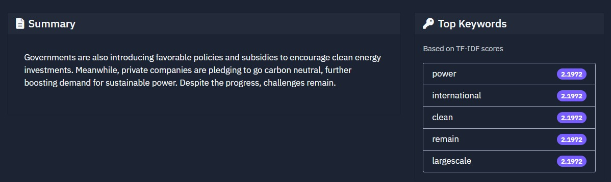

# Article Summarizer

A full-stack application that summarizes articles from URLs using advanced NLP models.

## Features

- Web scraping using newspaper3k
- Text preprocessing with spaCy
- Multiple summarization models (BART and LongT5)
- Coreference resolution
- MongoDB caching
- Modern React frontend with Tailwind CSS
- RESTful API

## Prerequisites

- Python 3.8+
- Node.js 14+
- MongoDB
- npm or yarn

## Setup

### Backend Setup

1. Create a virtual environment:
```bash
python -m venv venv
source venv/bin/activate  # On Windows: venv\Scripts\activate
```

2. Install dependencies:
```bash
pip install -r requirements.txt
```

3. Download spaCy model:
```bash
python -m spacy download en_core_web_sm
```

4. Create a `.env` file in the backend directory:
```
MONGODB_URI=mongodb://localhost:27017/
```

5. Start the backend server:
```bash
cd backend
python app.py
```

### Frontend Setup

1. Install dependencies:
```bash
cd frontend
npm install
```

2. Start the development server:
```bash
npm start
```

## Usage

1. Open your browser and navigate to `http://localhost:3000`
2. Enter an article URL
3. Select a summarization model (BART or LongT5)
4. Click "Summarize" to generate a summary

## API Endpoints

- `POST /api/summarize`: Generate article summary
  - Request body: `{ "url": "article_url", "model_type": "bart|longt5" }`
- `GET /api/health`: Health check endpoint

## 🖼️ Screenshots

## 🖼️ Screenshots

### 🔹 Home Page


### 🔹 Summary Output



## Technologies Used

- Frontend: React.js, Tailwind CSS
- Backend: Python (Flask)
- Database: MongoDB
- NLP: spaCy, Transformers (BART, LongT5)
- Web Scraping: newspaper3k

## License

MIT 
